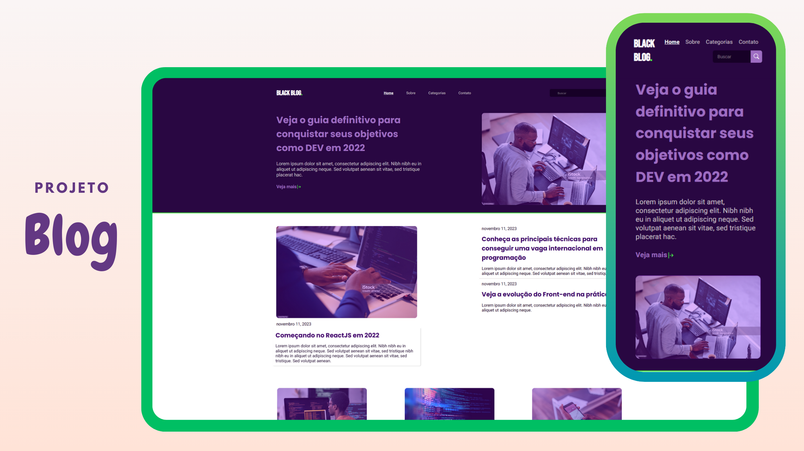

<h1 align="center">#10 Blog</h1>
<h2 align="center">Site Blog</h2>

 Um Blog de comércio eletrônico online que permite aos usuários comprar produtos.

  <a href="#-tecnologias">Tecnologias</a>&nbsp;&nbsp;&nbsp;|&nbsp;&nbsp;&nbsp;
  <a href="#-projeto">Projeto</a>&nbsp;&nbsp;&nbsp;|&nbsp;&nbsp;&nbsp;
  <a href="#-layout">Layout</a>&nbsp;&nbsp;&nbsp;|&nbsp;&nbsp;&nbsp;

  

 

  

## 🚀 Tecnologias

Esse projeto foi desenvolvido com as seguintes tecnologias:

- HTML e CSS
- Git e Github
- Figma e Canva para design

## 💻 Projeto

O blog é organizado de maneira intuitiva para facilitar a navegação. Você encontrará categorias específicas para cada tópico e uma barra de pesquisa para ajudar a localizar conteúdo específico.

## 🎨 Layout

Você pode visualizar o layout do projeto através [DESSE LINK](<https://jasonaraujo1.github.io/blog/>). 

- Header: O header do site contém links redirecionais que facilitam a navegação.

- Botões de Navegação: Além dos links no header, botões com links são estrategicamente colocados na página inicial, facilitando o acesso a áreas específicas do site.

- Site corresponde bem no formato mobile. 

## 🔍 Instruções do Site

- Navegação Fácil: O layout do site é intuitivo, imagens e textos bem organizados.

- Pesquisa Avançada: Os usuários têm a opção de usar uma função de pesquisa avançada para encontrar assuntos com base em critérios específicos.

## :memo: Licença

Esse projeto está sob a licença MIT.

---

Instruções pela [Sua Empresa/Equipe](https://seusite.com) :wave: [Participe da nossa comunidade!](https://discord.gg/sua-comunidade)
